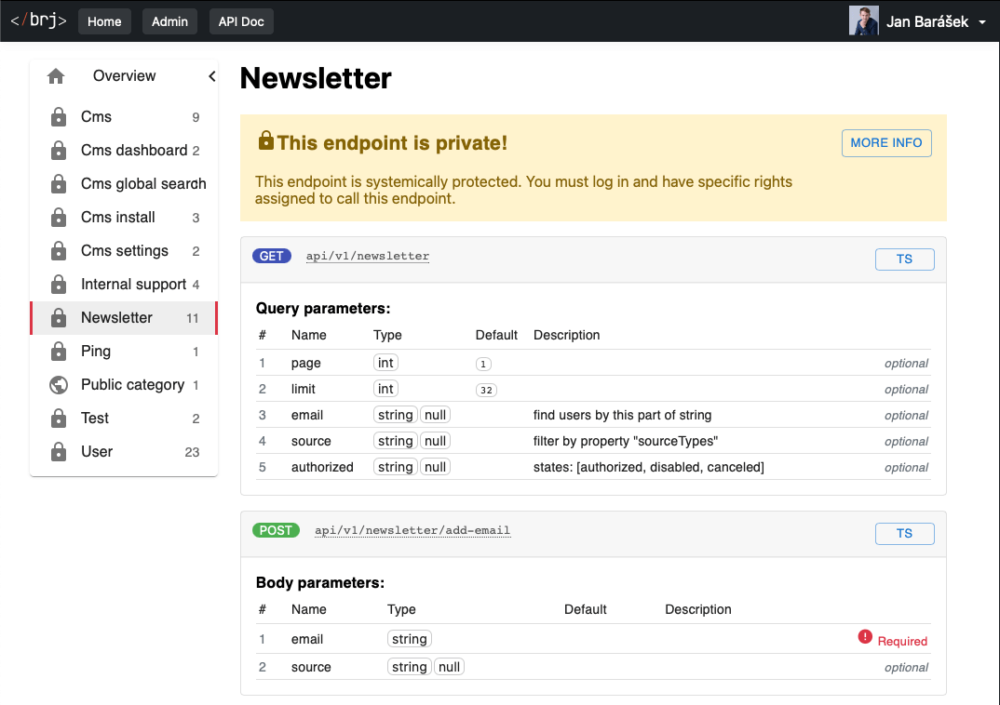

Structured API Documentation
============================

Fully automated tool for documentation.

📦 Installation
---------------

It's best to use [Composer](https://getcomposer.org) for installation, and you can also find the package on
[Packagist](https://packagist.org/packages/baraja-core/structured-api-doc) and
[GitHub](https://github.com/baraja-core/structured-api-doc).

To install, simply use the command:

```shell
$ composer require baraja-core/structured-api-doc
```

You can use the package manually by creating an instance of the internal classes, or register a DIC extension to link the services directly to the Nette Framework.



Idea
----

When developing any application, developers must maintain both the source code itself and documentation describing the general functionality for others. Writing documentation in a separate system takes more time, leads to human error, and makes the documentation obsolete over time. BRJ solves this problem by allowing developers to write documentation directly into comments in the source code, and then always machine-generate the page consistently.

How to start using BRJ documentation?

1. Use Structured API endpoints (implementing [Baraja Structured API](https://github.com/baraja-core/structured-api)) to your application
2. Install this package
3. Open URL `/api-documentation`

Sample endpoint implementation with native comments:

```php
/**
 * Common API endpoint for robust article manipulation.
 *
 * @endpointName Article manager
 */
final class ArticleEndpoint extends BaseEndpoint
{
   #[Inject]
   public ArticleManagerAccessor $articleManager;


   /**
    * @param string $locale in format "cs" or "en"
    * @param int $page real page number for filtering, 1 => first page ... "n" page
    * @param string|null $filterTitle filter by words in title?
    * @param string|null $filterFrom find all articles from this date
    * @param string|null $filterTo find all articles to this date
    */
   public function actionDefault(string $locale, int $page = 1, ?string $filterTitle = null, ?string $filterFrom = null, ?string $filterTo = null): void
   {
      // Here is some body...
```

📄 License
-----------

`baraja-core/structured-api-doc` is licensed under the MIT license. See the [LICENSE](https://github.com/baraja-core/template/blob/master/LICENSE) file for more details.
